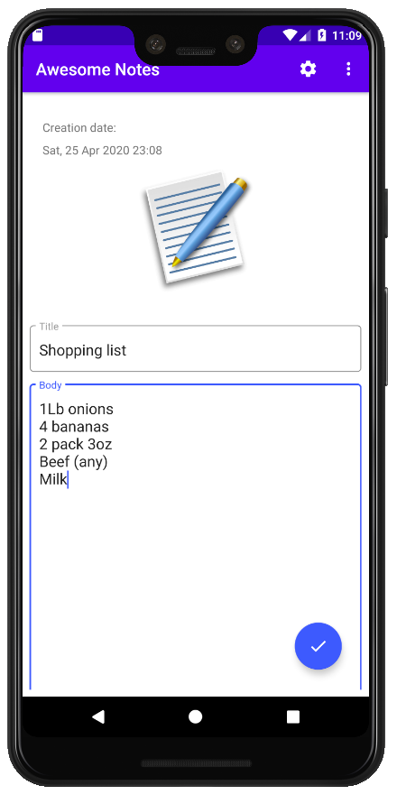

# Awesome-Notes

### Personal project.

This project contains some components such as ViewModel, Fragments, RecyclerView, CardView, ViewPager, TabLayout.
Also, I used Firebase: Authentication module and Cloud Firestore. I implemented a MVVM architecture, and other components
are also used such as Glide, Shared Preferences, and OptionMenu.

The comunication between components is made throughout interfaces.

## Steps for running this project:

**1.** Create Firebase project: https://firebase.google.com/

**2.** Generate json file and add into app folder (see firebase instructions for details).

**3.** Authentication module: Enabled sign in methods (Email and Google accounts).

**4.** Google account must be added SHA-1 and SHA-256 into project settings (see firebase docs for details:
https://developers.google.com/android/guides/client-auth).

**5.** Database module: create a new database cloud firestore.

**6.** Create a new collection called "notes" with fields like the last image.

**7.** Can execute the project.

#

  
  
  
 

